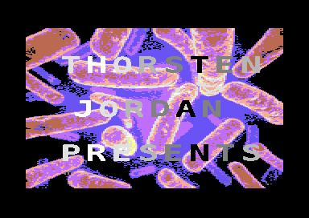

# bacillus_c64
Jump and run game for the C64.
Control a bacillus to hunt for food.

How to run the game?
Of course it works perfectly in the VICE emulator, e.g. under Linux start it
with:

x64 --autostart bacillus.prg

Note that the .prg file is already available in the code repository.

For a real C64 there are various possibilities. First is to use the existing
.D64 disk image file (generated with  make bacillus.d64  or already
available) and transfer it with X1541 to a real floppy disk and load
the game with read hardware. Or use the floppy emulator hardware with SD
cards etc.

Technical facts:
* 2-way side scrolling game
* parallax scrolling
* animated background and level data
* animated characters
* bonus collecting
* score accounting
* intro
* main screen
* two levels

Planned:
* Outtro
* Highscore handling in mainscreen
* More levels (planned 3-6)
* More level graphics
* More enemies
* Boni like 1up, shield, explode
* Music/Sfx

