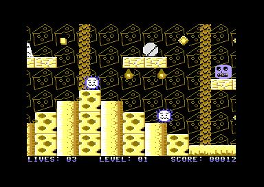
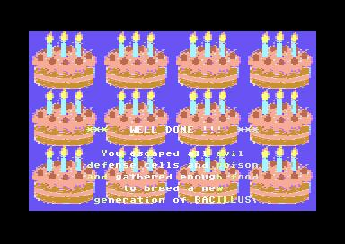

# bacillus_c64
Jump and run game for the C64.
Control a bacillus to hunt for food.

How to run the game?
Of course it works perfectly in the VICE emulator, e.g. under Linux start it
with:

x64 --autostart bacillus.prg

Note that the .prg file is already available in the code repository.

For a real C64 there are various possibilities. First is to use the existing
.D64 disk image file (generated with  make bacillus.d64  or already
available) and transfer it with X1541 to a real floppy disk and load
the game with real hardware. Or use the floppy emulator hardware with SD
cards etc.

For example use OpenCBM and its program d64copy to transfer the .D64 files:

d64copy bacillus.d64 8

for a drive connected via a X(U)1541 cable or device.

Technical facts:
* 2-way side scrolling game (smooth 50 fps)
* parallax scrolling
* animated background and level data
* animated characters
* bonus collecting
* score accounting
* intro
* main screen
* 3 levels in 3 worlds
* special tiles that vaporize
* special boni like invulnerability and 1-up
* dying animation
* enemies leaving screen stay alive and can return
* cheat in main menu to select level
* two different actor behaviours
* traps
* high scores loaded from and saved to disk
* Outtro

Planned:
* More levels (planned 6)
* Some more gfx gimmicks
* Music/Sfx

